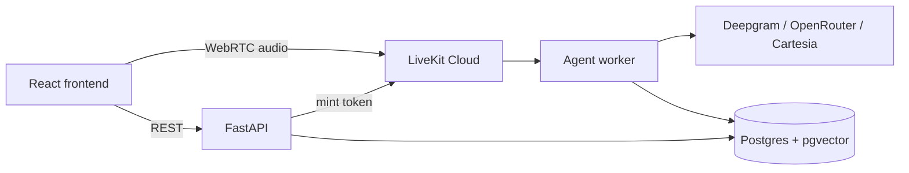

# Voice Agent

A real-time voice AI agent that answers inbound phone calls, answers questions from a knowledge base, and books appointments — over a live WebRTC call, not a chat window.

## Overview

Voice Agent is an end-to-end conversational AI system built around a phone-style interaction: a caller connects over WebRTC, speaks naturally, and is routed through a state machine that either answers a question grounded in a small knowledge base (RAG) or walks them through booking, rescheduling, or cancelling an appointment. If neither path fits, the call is flagged for human follow-up instead of the agent guessing.

The project is built as a demo for a fictional small business (a hair salon) but the pipeline itself is domain-agnostic: swap the knowledge base content and booking logic, and the same STT → LLM → TTS pipeline, conversation state machine, and persistence layer apply.

Every call is transcribed turn-by-turn and persisted, along with any resulting appointment, to Postgres. A small read-only REST API exposes that history for a dashboard.

The system runs entirely on free-tier infrastructure: LiveKit Cloud, Supabase, Hugging Face Spaces, and OpenRouter.

## Features

- Real-time, full-duplex voice conversation over WebRTC (browser mic in, synthesized speech out)
- Conversation state machine with agent handoff — an `IntentAgent` routes the caller to a dedicated `BookingAgent` for the booking flow, then hands back
- RAG-grounded Q&A: retrieval over a Postgres/pgvector-backed knowledge base, with the model instructed to answer only from retrieved context
- Appointment booking with conflict detection (rejects a duplicate booking under the same name instead of silently creating one) and a keep-both/replace resolution flow
- Escalation path for requests the agent can't handle
- Every call and turn persisted to Postgres, with a read-only REST API over calls, transcripts, and appointments
- Server-minted, short-lived LiveKit access tokens — the browser client never sees API secrets
- React frontend with a marketing landing page and a live in-browser call demo

## Tech Stack

**Voice pipeline (Python)**
- `livekit-agents` — session orchestration, job worker, conversation state machine
- Deepgram (Nova-3) — speech-to-text, with keyterm prompting tuned to domain vocabulary
- GPT-4o-mini via OpenRouter — LLM, through the OpenAI-compatible plugin interface
- Cartesia — text-to-speech
- Silero — voice activity detection

**Backend / API**
- FastAPI — token minting and read-only dashboard endpoints
- asyncpg — direct async Postgres connection pool (bypasses the REST/SDK client)

**Persistence**
- Supabase (Postgres + pgvector), row-level security enabled on every table

**RAG**
- Hugging Face Inference API (`sentence-transformers/all-MiniLM-L6-v2`) for embeddings
- pgvector with an HNSW index for cosine-similarity retrieval

**Frontend**
- React, TypeScript, Vite
- Tailwind CSS
- `@livekit/components-react` / `livekit-client` for the in-browser call UI
- React Router

**Infrastructure**
- LiveKit Cloud — WebRTC transport and room/agent dispatch
- Hugging Face Spaces (Gradio SDK) — hosts the agent worker and API
- Vercel — hosts the frontend

## Architecture



The agent worker and API are both hosted in a single Hugging Face Space process; the FastAPI routes are mounted onto the same app instance that satisfies the Space's health check.

## Project Structure

```text
agent/
├── app.py                 # Hugging Face Space entrypoint: mounts the API, starts the worker
├── voice_agent.py          # Session wiring — STT/LLM/TTS/VAD, call persistence hooks
├── pipeline_agents.py       # Conversation state machine (IntentAgent, BookingAgent)
├── rag.py                   # Embeddings + pgvector retrieval
├── db.py                    # Postgres persistence (asyncpg)
├── kb_content.py             # Seed content for the knowledge base
├── connectivity_spike.py     # Minimal LiveKit connectivity check (no AI providers)
├── api/
│   ├── calls.py               # /api/token
│   └── dashboard.py           # /api/calls, /api/appointments
├── Dockerfile
└── requirements.txt

frontend/
├── src/
│   ├── pages/                # Landing, Demo
│   ├── components/landing/
│   └── lib/api.ts             # API client
├── package.json
└── vercel.json

db/
└── schema.sql               # Postgres schema (calls, turns, appointments, kb_documents, kb_chunks)
```


